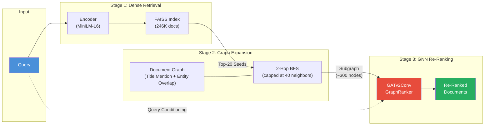

<div align="center">

# Graph-Augmented Retrieval for Multi-Hop Question Answering

**A GNN-based document re-ranking system that solves the multi-hop retrieval bottleneck by propagating query relevance through a document knowledge graph.**

[](https://python.org)
[](https://pytorch.org)
[](https://pyg.org)
[](https://ray.io)
[](https://github.com/facebookresearch/faiss)
[](https://spacy.io)
[](https://wandb.ai)
[](https://hub.docker.com/r/abdullahrashid/graph-retriever)
[](https://huggingface.co/sentence-transformers)
[](LICENSE)

</div>

---

## The Problem

Standard vector-based retrieval (RAG) finds documents that are **semantically similar to the query**. But multi-hop questions require reasoning across **multiple interconnected documents**, where the 2nd-hop document may share zero semantic overlap with the original question.

> **Example:** *"What government position was held by the woman who helped found the Planned Parenthood clinic in Brownsville?"*
>
> - **Hop 1:** *"Margaret Sanger founded the first Planned Parenthood clinic in Brownsville, Brooklyn."* ← semantically close to query
> - **Hop 2:** *"Margaret Sanger served as the first president of the International Planned Parenthood Federation."* ← semantically **distant** from query, but connected through entity `Margaret Sanger`

**Vector RAG retrieves Hop 1 but misses Hop 2.** This system solves this by building a document graph and using a GNN to propagate query relevance through graph edges, surfacing the critical 2nd-hop documents.

---

## System Architecture



### Pipeline Breakdown

| Stage | Component | Purpose |
|-------|-----------|---------|
| **1. Encode** | `all-MiniLM-L6-v2` | Embed query into 384-dim normalized vector |
| **2. Retrieve** | FAISS `IndexFlatIP` | Find top-20 seed documents by cosine similarity |
| **3. Expand** | 2-Hop BFS on document graph | Discover multi-hop connections (capped at 40 neighbors/hop to prevent subgraph explosion) |
| **4. Re-Rank** | `GATv2Conv` GraphRanker | Score every node in the subgraph conditioned on the query, using learned attention over graph edges |

---

## Model: Query-Conditioned GATv2 GraphRanker

The core innovation is a **query-conditioned Graph Attention Network** that learns to propagate relevance signals through the document graph.

### Architecture

```
Input:  x ∈ ℝ^(N×384)     (node embeddings)
        q ∈ ℝ^(1×384)     (query embedding)

1. Query-Conditioned Gating
   q_node = broadcast(q, batch)           # [N, 384]
   gate = σ(MLP([x ∥ q_node]))           # [N, 384]
   x₀ = x ⊙ gate                          # suppress irrelevant features

2. Feature Construction
   interaction = x₀ ⊙ q_node              # element-wise relevance
   h = [x₀ ∥ q_node ∥ interaction]       # [N, 1152]

3. Graph Message Passing
   h = ReLU(GATv2Conv₁(h, edges))         # [N, 512]  (256 × 2 heads)
   h = ReLU(GATv2Conv₂(h, edges))         # [N, 256]  (256 × 1 head)

4. Projection + Residual
   out = Linear(h) + x₀                   # [N, 384]
   out = L2Normalize(out)                  # unit sphere

Score: score(doc_i) = out_i · q            # cosine similarity
```

### Key Design Decisions

- **GATv2Conv over RGATConv:** RGATConv creates per-relation weight matrices that caused OOM on T4 GPUs. GATv2Conv with learned edge embeddings (`nn.Embedding(2, 64)`) achieves the same expressivity with 10× less memory.
- **Query-Conditioned Gating:** A sigmoid gate `σ(MLP([x, q]))` selectively suppresses irrelevant node features *before* message passing, preventing noise propagation.
- **Residual Connection:** `out = projection(h) + x₀` preserves the base semantic similarity from the pre-trained embeddings, so the GNN only needs to learn the *delta* from graph structure.
- **Neighbor Capping:** BFS expansion is capped at 40 neighbors per hop. Without this, hub nodes (e.g., "United States") explode to 50K+ edges and crash training.

---

## Training: SigLIP Loss with Dynamic Class Balancing

### The Challenge

Each training subgraph contains ~200-500 nodes but only **2 gold documents** per query — a 250:1 negative-to-positive ratio. Standard BCE loss collapses to near-zero by predicting everything as negative.

### Our Solution: Multi-Positive Sigmoid Loss

We adapt the [SigLIP](https://arxiv.org/abs/2303.15343) pairwise sigmoid loss with **dynamic positive weighting**:

$$\mathcal{L} = -\frac{1}{Q \times N}\sum_{i=1}^{Q}\sum_{j=1}^{N} \left[ w_{pos} \cdot y_{ij} \cdot \log\sigma(s_{ij}) + (1-y_{ij}) \cdot \log(1-\sigma(s_{ij}))\right]$$

Where:
- $s_{ij} = e^t \cdot (\mathbf{q}_i \cdot \mathbf{d}_j) + b$ — scaled cosine similarity with learnable temperature $t$ and bias $b$
- $y_{ij} \in \{0, 1\}$ — 1 if document $j$ is a gold supporting document for query $i$
- $w_{pos} = N_{neg} / N_{pos}$ — **dynamic positive weight** computed per batch to balance gradient contributions

This formulation treats every `(query, document)` pair independently (no softmax competition), supporting **multiple positives per query** — critical for HotpotQA where each question has exactly 2 gold supporting documents.

---

## Results

Evaluated on the **HotpotQA test set** (5,000 multi-hop queries, 246K document corpus).

| Metric | Vector RAG | Graph-Augmented RAG | **Δ Improvement** |
|--------|:----------:|:-------------------:|:------------------:|
| **Recall@5** | 0.5508 | **0.6421** | +16.6% |
| **Recall@10** | 0.6124 | **0.7272** | +18.8% |
| **Recall@20** | 0.6599 | **0.7901** | +19.7% |
| **EM@5** | 0.2500 | **0.4402** | +76.1% |
| **EM@10** | 0.3322 | **0.5706** | +71.8% |
| **EM@20** | 0.3990 | **0.6688** | +67.6% |
| **nDCG@5** | 0.5579 | **0.6091** | +9.2% |
| **nDCG@10** | 0.5822 | **0.6432** | +10.5% |
| **nDCG@20** | 0.5970 | **0.6628** | +11.0% |
| **MAP** | 0.4904 | **0.5613** | +14.5% |

> **Exact Match (EM)** is the critical metric for multi-hop QA — it requires finding **both** gold documents in the top-K. Our system achieves a **+76% improvement** in EM@5, demonstrating that the GNN successfully propagates query relevance through graph edges to surface the 2nd-hop document that vector search alone cannot find.

### Metric Definitions
- **Recall@K**: Fraction of gold documents found in the top-K (0.0 / 0.5 / 1.0 for 2-gold-doc queries)
- **EM@K**: 1 if **all** gold documents are in top-K, else 0
- **nDCG@K**: Normalized Discounted Cumulative Gain — rewards finding gold docs at higher ranks
- **MAP**: Mean Average Precision across all queries

---

## Quick Start

### Option 1: Docker (Recommended)

Pull and run with zero setup — all data and model weights are baked into the image:

```bash
docker pull abdullahrashid/graph-retriever:v1
docker run -p 8000:8000 abdullahrashid/graph-retriever:v1
```

Query the API:

```bash
curl -X POST http://localhost:8000/retrieve \
  -H "Content-Type: application/json" \
  -d '{
    "query": "What government position was held by the woman who helped found the Planned Parenthood clinic in Brownsville?",
    "top_k": 5
  }'
```

Health check:

```bash
curl http://localhost:8000/health
```

### Option 2: Local Setup

```bash
# Clone and install
git clone https://github.com/abdullahrashid/graph-augmented-retrieval-system.git
cd graph-augmented-retrieval-system
python -m venv venv && source venv/bin/activate
pip install -e .

# Start the server
python service/serve.py
```

### API Response Format

```json
{
  "query": "What government position was held by...",
  "top_k": 5,
  "results": [
    {
      "rank": 1,
      "chunk_id": "a1b2c3d4e5f6",
      "score": 0.8723,
      "text": "Margaret Sanger served as the first president of the International Planned Parenthood Federation..."
    },
    {
      "rank": 2,
      "chunk_id": "f6e5d4c3b2a1",
      "score": 0.8541,
      "text": "The Brownsville clinic was opened by Margaret Sanger and her sister Ethel Byrne in 1916..."
    }
  ],
  "metadata": {
    "model": "GATv2Conv-GraphRanker",
    "subgraph_nodes": 342,
    "subgraph_edges": 1205
  }
}
```

---

## Project Structure

```
├── configs/
│   ├── config.yaml               # Training & evaluation config
│   └── serving.yaml              # Inference-only config
├── src/
│   ├── data/
│   │   ├── corpus.py             # HotpotQA corpus extraction
│   │   ├── dataset.py            # PyG SubgraphDataset with on-the-fly BFS
│   │   ├── graph.py              # Document graph construction (title mention + entity overlap)
│   │   └── vectorstore.py        # FAISS index + embedding computation
│   ├── models/
│   │   ├── gnn.py                # GATv2Conv GraphRanker
│   │   └── loss.py               # Multi-Positive Sigmoid Loss with dynamic pos_weight
│   ├── serving/
│   │   └── inference.py          # RetrievalPipeline (end-to-end inference)
│   └── evaluation/
│       └── evaluator.py          # Recall@K, EM@K, nDCG@K, MAP
├── service/
│   └── serve.py                  # Ray Serve deployment
├── scripts/
│   ├── train.py                  # Training loop with tqdm, W&B, early stopping
│   └── evaluate.py               # Evaluation harness
├── notebooks/
│   ├── train_gnn.py              # Self-contained Kaggle training notebook
│   └── evaluate_gnn.py           # Self-contained Kaggle evaluation notebook
├── Dockerfile                    # Production-ready container
└── pyproject.toml                # Project dependencies
```

---

## Technical Details

### Document Graph Construction

The knowledge graph connects 246K documents through two edge types:

| Edge Type | Method | Count |
|-----------|--------|-------|
| **Title Mention** | Aho-Corasick exact match of document titles in other documents' text | High precision |
| **Entity Overlap** | spaCy NER extraction → documents sharing ≥1 named entity (PERSON, ORG, GPE, LOC, etc.) | High recall |

### Training Configuration

| Hyperparameter | Value |
|----------------|-------|
| Optimizer | AdamW |
| Learning Rate | 1e-3 |
| Weight Decay | 1e-4 |
| Batch Size | 2 (due to large subgraphs) |
| Epochs | 15 |
| Warmup | 2 epochs |
| LR Schedule | CosineAnnealingLR |
| Gradient Clipping | max_norm=1.0 |
| GNN Hidden Dim | 256 |
| GAT Heads | 2 → 1 |
| Dropout | 0.2 |

### Memory Optimizations

- **Neighbor Capping:** BFS expansion limited to 40 neighbors/hop (14 during training) to prevent OOM from hub node explosion
- **GATv2Conv:** Replaced RGATConv (which creates per-relation weight matrices) with GATv2Conv + learned edge embeddings for 10× memory reduction
- **Memory-Mapped Embeddings:** Document embedding matrix loaded with `mmap_mode='r'` to avoid loading 360MB into RAM during dataset construction

---

## Training & Evaluation

### Train on Kaggle

Upload the `notebooks/train_gnn.py` notebook to Kaggle with a T4 GPU accelerator and the preprocessed dataset.

### Evaluate

```bash
cd scripts
python evaluate.py --checkpoint ../checkpoints/v1-rgatv2conv/best_model.pt
```

---

## License

This project is licensed under the MIT License — see the [LICENSE](LICENSE) file for details.
